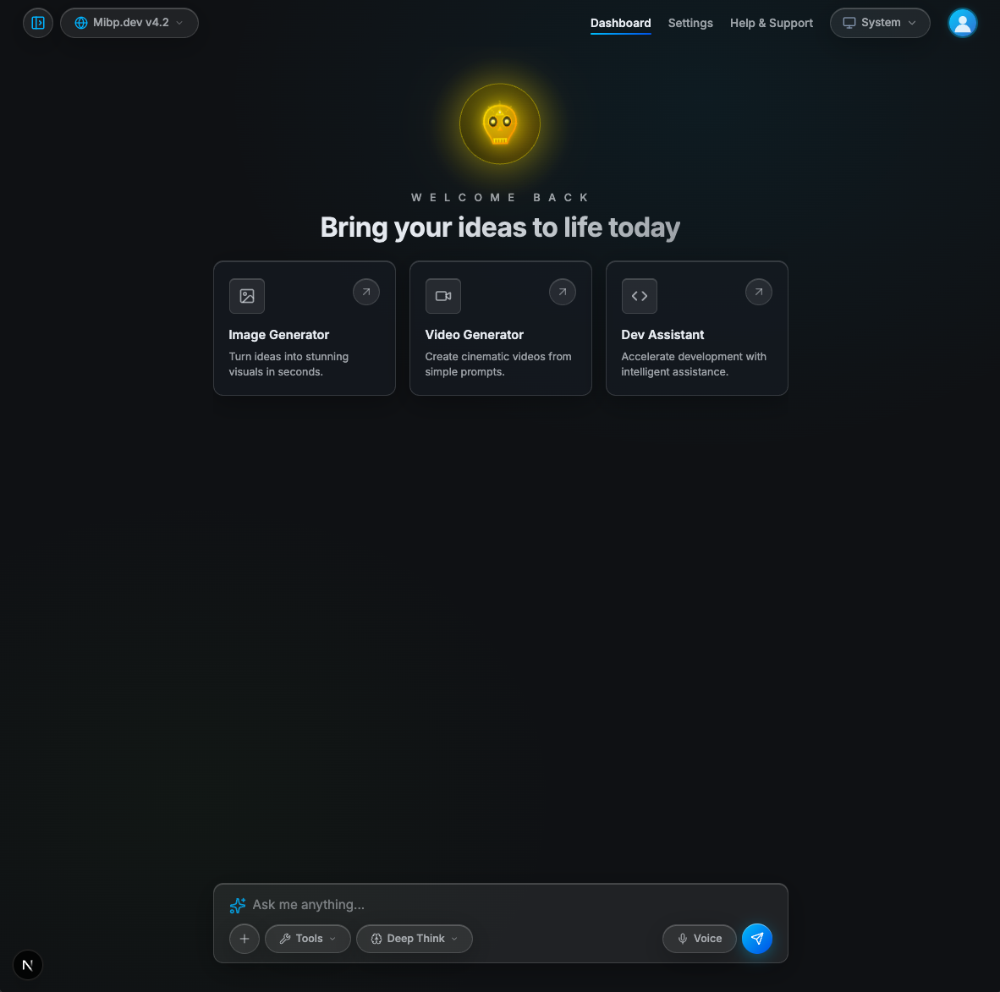

# Mibp.dev — AI Chat Dashboard


**Mibp.dev** is an ultra-modern, high-performance AI Chat Dashboard inspired by the sleek document-flow interfaces of ChatGPT and Claude. Featuring an interactive Glassmorphism (Frosted Glass) design system, dynamic theme support (System, Light, Dark), and interactive AI tools.



---

## 🌟 Key Features

- 💎 **Glassmorphism & Frosted Glass Design System**: Premium translucent cards, glossy borders, backdrop blurs, and neon glowing hover highlights.
- 💬 **Open ChatGPT/Claude Feed Flow**: Clean text stream layout without modal box constraints. Supports code blocks with dedicated language copy buttons, media previews, and a bottom action bar (Copy, Regenerate/Restart, Like, Dislike).
- 🔍 **Command Palette Search Modal (`Cmd + K` / `Ctrl + K`)**: Instant search dialog filtering recent chat sessions and last opened items.
- 💛 **Cyberpunk Electric Yellow AI Skull Hero**: Animated floating 3D graphic with electric gold neon aura.
- ↔️ **Hideable Sidebar**: Desktop sidebar toggle button (`PanelLeftClose` / `PanelLeftOpen`) to maximize workspace real estate, plus slide-in drawer for mobile screens.
- ⚙️ **Interactive Feature Modals**:
  - ⚙️ **Settings**: Theme selection, language options, AI model picker, streaming & privacy controls.
  - 👑 **Upgrade Plan**: Tiered pricing cards (Free, Pro, Enterprise).
  - 📁 **File & Image Upload**: Drag & drop file attachment dialog.
  - 🛠️ **AI Tools Panel**: Web Search, Calculator, Code Runner, Image Analysis, Document Reader, Translator.
  - 🎙️ **Voice Recording**: Interactive recording interface with live audio waveform simulation.
  - 👤 **User Profile**: Account statistics, active plan status, and settings shortcuts.
  - ❓ **Help & Support**: Quick links to documentation, live chat, and support channels.

---

## 🛠️ Tech Stack

- **Framework**: [Next.js 16 (App Router)](https://nextjs.org/)
- **UI Components & Icons**: [Lucide React Icons](https://lucide.dev/) + [shadcn/ui Primitives](https://ui.shadcn.com/)
- **Styling**: Tailwind CSS v4 + PostCSS + CSS Modules
- **State Management**: [Zustand](https://github.com/pmndrs/zustand)
- **Data Fetching / Mutations**: [TanStack Query v5](https://tanstack.com/query/latest)
- **Animations**: [Motion](https://motion.dev/)

---

## 🚀 Getting Started

### Prerequisites

- **Node.js**: `v18.17` or higher
- **npm** / **yarn** / **pnpm** / **bun**

### Installation

1. **Clone the repository**:
   ```bash
   git clone git@github.com:mhiqrambg/mibp-chat-ai-dashboard.git
   cd mibp-chat-ai-dashboard
   ```

2. **Install dependencies**:
   ```bash
   npm install
   ```

3. **Run the development server**:
   ```bash
   npm run dev
   ```

4. **Open in Browser**:
   Navigate to [http://localhost:3000](http://localhost:3000).

---

## 📂 Project Structure

```text
mibp-chat-ai-dashboard/
├── src/
│   ├── app/
│   │   ├── globals.css          # Core Glassmorphism design system tokens & theme variables
│   │   ├── layout.js           # Root layout & app metadata
│   │   ├── page.js             # Main dashboard page
│   │   └── page.module.css
│   ├── components/
│   │   ├── ChatFeed.js         # Open document flow chat messages & code blocks
│   │   ├── ChatInput.js        # Prompt input bar with action pills (Tools, Deep Think, Voice, Upload)
│   │   ├── FeatureCards.js     # Image Generator, Video Generator, Dev Assistant cards
│   │   ├── Hero.js             # Welcome hero section with animated yellow AI Skull
│   │   ├── MobileDrawer.js     # Mobile slide-in navigation drawer
│   │   ├── Modals.js           # Settings, Upgrade, Upload, Tools, Voice, Profile, Help modals
│   │   ├── SearchModal.js      # Command palette search dialog (Cmd + K)
│   │   ├── Sidebar.js          # Desktop navigation sidebar with toggle button
│   │   ├── ThemeToggle.js      # System / Light / Dark mode switcher
│   │   └── TopNav.js           # Top header navigation bar
│   ├── context/
│   │   └── ThemeContext.js     # Theme preference manager
│   ├── data/
│   │   └── mockData.js         # Simulated API response generator & chat history dataset
│   ├── lib/
│   │   └── utils.js            # Classname merger helper (cn)
│   ├── providers/
│   │   └── QueryProvider.js    # TanStack Query client provider
│   └── store/
│       └── useChatStore.js     # Centralized Zustand store
├── components.json             # shadcn/ui configuration
├── postcss.config.mjs          # Tailwind CSS v4 PostCSS setup
├── package.json
└── README.md
```

---

## 📜 License

Distributed under the MIT License. See `LICENSE` for more information.

---

Crafted with ❤️ by **[Mibp.dev](https://github.com/mhiqrambg)**
